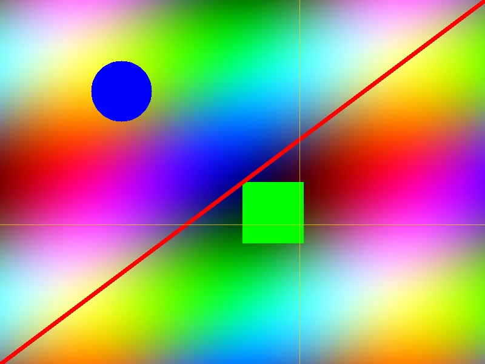
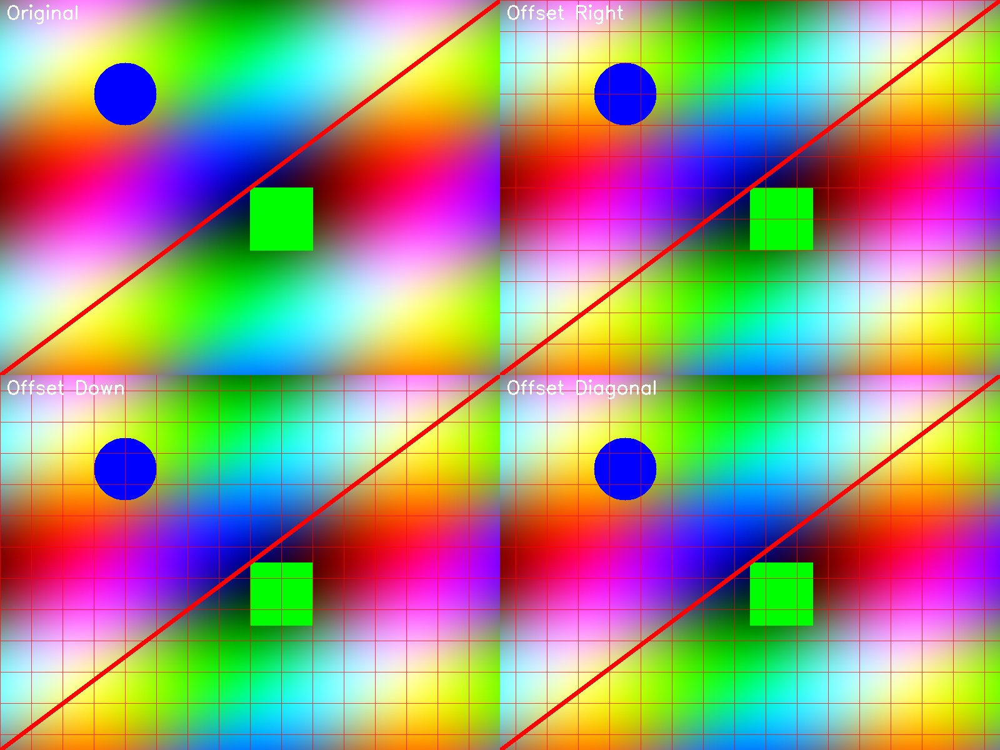

# Image Grid Drawing Tool


A powerful Streamlit application for adding customizable grids to images. Perfect for photographers, designers, and anyone working with visual composition.

## Features

- **Multiple Grid Types**:
  - Fixed-size grid (pixel-based)
  - Fixed number of cells
  - Golden ratio grid
  - Rule of thirds
  - Center lines

- **Customizable Appearance**:
  - Adjustable colors (preset or custom)
  - Line thickness control
  - Opacity settings
  - Solid or dashed lines

- **Interactive Grid Positioning**:
  - Move grid up, down, left, and right with arrow buttons
  - Precise positioning with sliders
  - Reset to default position

- **Guide Lines**:
  - Add adjustable horizontal and vertical guide lines
  - Customize guide line appearance

- **Multiple Image Sources**:
  - Upload your own images
  - Use your device camera
  - Try with a sample image

- **Export Options**:
  - Download images with applied grids
  - Smart file naming based on grid type

## Installation

1. Clone this repository:
   ```bash
   git clone https://github.com/lhstorm/image_grid.git
   cd image_grid
   ```

2. Create a virtual environment (optional but recommended):
   ```bash
   python -m venv venv
   source venv/bin/activate  # On Windows: venv\Scripts\activate
   ```

3. Install the required dependencies:
   ```bash
   pip install -r requirements.txt
   ```

## Usage

1. Run the Streamlit app:
   ```bash
   streamlit run streamlit_app.py
   ```

2. Open your web browser and navigate to the URL displayed in the terminal (typically http://localhost:8501)

3. Use the sidebar to:
   - Select an image source (upload, camera, or sample)
   - Choose and customize your grid type
   - Position the grid using arrow buttons or sliders
   - Adjust advanced settings like guide lines

4. Download your image with the applied grid using the download button

## Example Code

Here's a simple example of how to use the underlying grid drawing functions in your own Python code:

```python
from image_grid import load_image, draw_grid, draw_adaptive_grid

# Load an image
image = load_image("path/to/your/image.jpg")

# Draw a fixed-size grid (50x50 pixels)
grid_image = draw_grid(image, grid_size_x=50, grid_size_y=50)

# Draw an adaptive grid (10x8 cells)
adaptive_grid_image = draw_adaptive_grid(image, num_cells_x=10, num_cells_y=8)

# Draw a grid with custom offset (position)
offset_grid_image = draw_grid(image, grid_size_x=50, grid_size_y=50, offset_x=25, offset_y=25)
```

## Screenshots


*Fixed-size grid with 50x50 pixel cells*


*Golden ratio grid with 2 divisions*


*Different grid positions using the offset controls*

## Requirements

- Python 3.7+
- Streamlit
- OpenCV (cv2)
- NumPy
- Matplotlib
- Pillow (PIL)

See `requirements.txt` for specific version requirements.

## Troubleshooting

- **Image not displaying**: Make sure your image is in a supported format (JPG, PNG, BMP)
- **Grid not visible**: Check that the grid opacity is set high enough and the color contrasts with your image
- **Grid position not changing**: Ensure you're using the arrow buttons or sliders in the Grid Position section
- **Performance issues with large images**: Consider resizing very large images before uploading

## Contributing

Contributions are welcome! Please feel free to submit a Pull Request.

## License

This project is licensed under the MIT License - see the LICENSE file for details. 
